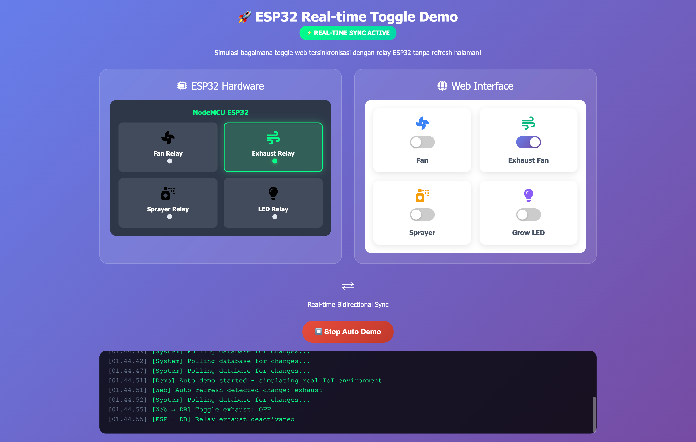

# 🚀 ESP32 Real-time Toggle Demo

[](https://github.com/yourusername/esp32-realtime-demo)
[](https://developer.mozilla.org/en-US/docs/Web/HTML)
[](https://developer.mozilla.org/en-US/docs/Web/CSS)
[](https://developer.mozilla.org/en-US/docs/Web/JavaScript)
[](https://www.espressif.com/en/products/socs/esp32)

> 🌟 **Simulasi interaktif yang mendemonstrasikan sinkronisasi real-time antara web interface dan hardware ESP32**


## 🎯 Overview

Proyek ini adalah demo visual yang menunjukkan bagaimana sistem IoT bekerja dengan sinkronisasi real-time antara:
- 🌐 **Web Interface** - Dashboard control yang responsif
- 🔌 **ESP32 Hardware** - Simulasi relay control pada mikrokontroler
- 🗄️ **Database Sync** - Sistem polling otomatis untuk menjaga konsistensi data

## ✨ Features

### 🎮 Interactive Controls
- **Toggle Switch Animation** - Smooth CSS transitions untuk UX yang premium
- **Real-time Bidirectional Sync** - Web ↔ ESP32 communication simulation
- **Visual Feedback** - LED indicators dan status animations

### 🔧 Hardware Simulation
- **4 Relay Channels**: Fan, Exhaust, Sprayer, LED
- **Auto-control Logic** - Sensor-triggered automation simulation
- **Status Monitoring** - Real-time relay state visualization

### 📊 Smart Features
- **Auto Demo Mode** 🤖 - Automated testing dengan random triggers
- **Activity Logging** 📝 - Real-time system activity monitor
- **Responsive Design** 📱 - Mobile-friendly interface

## 🛠️ Technology Stack

| Technology | Purpose | Badge |
|------------|---------|-------|
| **HTML5** | Structure & Semantics |  |
| **CSS3** | Styling & Animations |  |
| **Vanilla JS** | Logic & Interactivity |  |
| **Font Awesome** | Icon Library |  |

## 🚀 Quick Start

### 1️⃣ Clone Repository
```bash
git clone https://github.com/yourusername/esp32-realtime-demo.git
cd esp32-realtime-demo
```

### 2️⃣ Launch Demo
```bash
# Option 1: Direct browser
open index.html

# Option 2: Local server (recommended)
python -m http.server 8000
# Then open: http://localhost:8000
```

### 3️⃣ Start Exploring! 🎉
- Click toggle switches di web interface
- Watch ESP32 relays respond in real-time
- Try **Auto Demo Mode** untuk full experience
- Monitor activity log untuk detailed insights

## 🎭 Demo Modes

### 🎯 Manual Mode
- **Web Control**: Click switches to control devices
- **ESP Feedback**: Visual relay activation simulation
- **Database Sync**: Simulated polling every 5 seconds

### 🤖 Auto Demo Mode
- **Smart Automation**: Random device triggers
- **Sensor Simulation**: Temperature/humidity-based controls
- **Mixed Control**: 70% auto-control, 30% manual interaction

## 🏗️ Architecture Overview

```
┌─────────────────┐    ⚡ Real-time     ┌─────────────────┐
│   Web Interface │ ◄──── Sync ────► │  ESP32 Hardware │
│                 │                   │                 │
│ • Toggle UI     │                   │ • Relay Control │
│ • Status Display│                   │ • Sensor Input  │
│ • Activity Log  │                   │ • Auto Logic    │
└─────────┬───────┘                   └─────────┬───────┘
          │                                     │
          ▼                                     ▼
    ┌─────────────────────────────────────────────────┐
    │           📊 Database/State Manager             │
    │                                                 │
    │ • Device States (fan, exhaust, sprayer, led)   │
    │ • Polling Mechanism (5s intervals)             │
    │ • Change Detection & Distribution               │
    └─────────────────────────────────────────────────┘
```

## 💡 Key Concepts Demonstrated

### 🔄 Real-time Synchronization
- **Polling Strategy**: Simulates ESP32 checking database every 5 seconds
- **Bidirectional Updates**: Web → Database → ESP32 dan sebaliknya
- **State Consistency**: Ensures UI dan hardware always in sync

### 🎨 Modern UI/UX Principles
- **Glassmorphism Design**: Backdrop blur effects untuk modern look
- **Micro-interactions**: Hover effects, transitions, animations
- **Visual Hierarchy**: Clear information architecture
- **Accessibility**: Semantic HTML dan proper contrast ratios

### ⚡ Performance Optimizations
- **CSS Animations**: Hardware-accelerated transitions
- **Efficient DOM Updates**: Minimal reflow/repaint operations
- **Memory Management**: Automatic log cleanup (max 20 entries)

## 📱 Responsive Design

| Breakpoint | Layout | Features |
|------------|--------|----------|
| **Desktop** (>768px) | 2-column grid | Full feature set |
| **Tablet** (≤768px) | Single column | Adaptive controls |
| **Mobile** | Stacked layout | Touch-optimized |

## 🔮 Future Enhancements

- [ ] 🌐 **WebSocket Integration** - True real-time communication
- [ ] 📈 **Data Visualization** - Charts untuk device usage patterns
- [ ] 🔐 **Authentication** - User management system
- [ ] 📱 **PWA Support** - Offline capabilities
- [ ] 🎵 **Sound Effects** - Audio feedback untuk interactions
- [ ] 🌙 **Dark/Light Theme** - User preference system
- [ ] 📊 **Analytics Dashboard** - Usage statistics dan insights

## 🤝 Contributing

Contributions are welcome! 🎉

1. **Fork** the repository
2. **Create** feature branch (`git checkout -b feature/amazing-feature`)
3. **Commit** changes (`git commit -m 'Add amazing feature'`)
4. **Push** to branch (`git push origin feature/amazing-feature`)
5. **Open** Pull Request

### 🐛 Bug Reports
Found a bug? Please open an issue with:
- **Description** of the problem
- **Steps to reproduce**
- **Expected vs actual behavior**
- **Browser/device information**

## 📄 License

This project is licensed under the **MIT License** - see the [LICENSE](LICENSE) file for details.

## 🙏 Acknowledgments

- 🎨 **Font Awesome** - Beautiful icons
- 🌈 **CSS Gradient** inspiration from various design systems
- 🚀 **ESP32 Community** - Hardware insights dan best practices
- 💡 **Open Source Community** - Continuous inspiration

## 📞 Contact & Support

- 📧 **Email**: yusronwirawan@yahoo.com
- 🌐 **Website**: [yourwebsite.com](https://yyusronwirawan.vercel.app)

---

<div align="center">

### 🌟 Star this repo jika helpful! 

**Made with ❤️ for the IoT Community**

[](https://github.com/yourusername/esp32-realtime-demo)
[](https://github.com/yourusername/esp32-realtime-demo)

</div>
